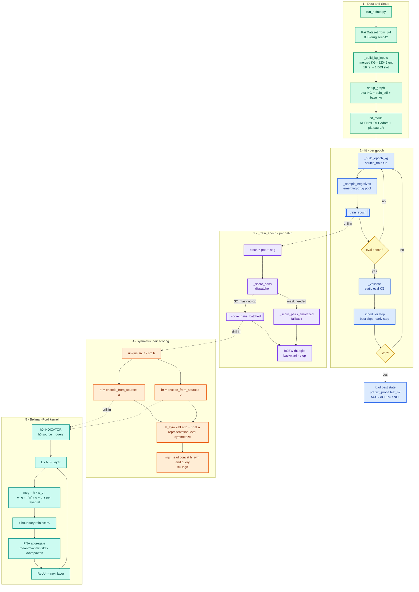

# NBFNet v1.7 — Training Pipeline Flow (cold-start S2 DDI)

Color-coded flow of the NBFNet v1.7 code path: data/setup, the per-epoch `fit`
loop, the per-batch `_train_epoch`, symmetric pair scoring, and the batched
Bellman-Ford kernel. Dotted "drill in" arrows zoom from a step to its internals.
(v1.71 = same flow + TF32/AMP wrap on `_score_pairs` + eval cadence in `fit`.)

